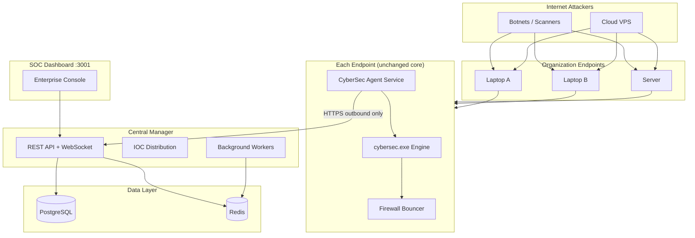

# CyberSec — Complete Codebase Reference

> **Master documentation** for the entire repository: what the solution is, how it works, every major feature, and how the pieces fit together.

---

## Table of Contents

1. [Executive Summary](#1-executive-summary)
2. [Problem & Solution](#2-problem--solution)
3. [System Architecture](#3-system-architecture)
4. [Feature Catalog](#4-feature-catalog)
5. [Repository Structure](#5-repository-structure)
6. [Core Detection Engine (CrowdSec Fork)](#6-core-detection-engine-crowdsec-fork)
7. [Local Demo Stack (Windows)](#7-local-demo-stack-windows)
8. [Enterprise EDR/XDR Platform](#8-enterprise-edrxdr-platform)
9. [Data Flow & Threat Propagation](#9-data-flow--threat-propagation)
10. [Configuration Reference](#10-configuration-reference)
11. [API Reference](#11-api-reference)
12. [Database Design](#12-database-design)
13. [Local Run Guide](#13-local-run-guide)
14. [Scripts & Operations](#14-scripts--operations)
15. [Testing Strategy](#15-testing-strategy)
16. [Security Model](#16-security-model)
17. [Technology Stack](#17-technology-stack)
18. [Quick Start Paths](#18-quick-start-paths)
19. [Documentation Index](#19-documentation-index)

---

## 1. Executive Summary

**CyberSec** is a full-stack **IDS/IPS** (Intrusion Detection / Prevention System) built on a **CrowdSec v1.7.8 fork**, rebranded and extended for Windows-first local development, hands-on security demos, and **enterprise fleet protection**.

| Layer | What It Does | Status |
|-------|--------------|--------|
| **Core Engine** | Log acquisition → parsing → scenario detection → alerts → ban decisions | Production-grade (upstream CrowdSec) |
| **Local Demo Stack** | Honeypot, firewall bouncer, dashboard, two-device attack demo | Windows-ready via `run.ps1` |
| **Enterprise Platform** | Multi-endpoint agent, central manager, SOC dashboard, IOC propagation | All 7 phases complete |

**Key insight:** The enterprise layer **wraps** the local engine — it does not replace parsers, scenarios, or remediation logic. Single-host demos continue to work unchanged.

| Item | Value |
|------|-------|
| Platform name | CyberSec |
| Go module (core) | `github.com/crowdsecurity/crowdsec` |
| Engine binary | `bin/cybersec.exe` |
| CLI binary | `bin/cybercli.exe` |
| Local config | `.local/cybersec-local.yaml` |
| Production path (Windows) | `C:\ProgramData\CyberSec\` |
| Upstream base | CrowdSec v1.7.8 (MIT License) |

---

## 2. Problem & Solution

### The Problem

Organizations need to:

1. **Detect** malicious behavior (brute force, port scans, floods, credential stuffing) from logs and network events
2. **Respond automatically** by blocking attacker IPs at the firewall or application layer
3. **Share threat intelligence** across endpoints so one detection protects the entire fleet
4. **Operate a SOC** with fleet visibility, incident triage, and audit trails
5. **Run safely on Windows** for development, demos, and lab environments without a Linux server

### The Solution

CyberSec delivers a **three-tier solution**:

```
┌─────────────────────────────────────────────────────────────────────────┐
│  TIER 3 — Enterprise EDR/XDR                                            │
│  Agent (Windows service) → Central Manager → SOC Dashboard              │
│  Cross-endpoint IOC sync, multi-tenant RBAC, fleet health               │
├─────────────────────────────────────────────────────────────────────────┤
│  TIER 2 — Local Demo & Enforcement                                      │
│  Honeypot + Firewall Bouncer + Dashboard + run.ps1 orchestration        │
│  Real automatic block demo across two devices on same Wi-Fi             │
├─────────────────────────────────────────────────────────────────────────┤
│  TIER 1 — Core Detection Engine (CrowdSec fork)                         │
│  Acquisition → Parsers → Scenarios → Profiles → LAPI → Decisions        │
│  Same technology used in production CrowdSec deployments worldwide      │
└─────────────────────────────────────────────────────────────────────────┘
```

**What makes this different from a toy demo:**

- The detection engine, leaky-bucket scenarios, Hub collections, and LAPI protocol are **real CrowdSec technology**
- What is "demo-like" in the default setup is only the **log source** (honeypot → `attack.log`) and the **Windows-specific orchestration scripts**
- Point acquisition at real logs (`auth.log`, Windows Event Log, nginx, etc.) and the same engine handles production traffic

---

## 3. System Architecture

### 3.1 Single-Host Architecture

```
Remote attack  →  Honeypot :9999  →  attack.log  →  Engine  →  Ban  →  Firewall  →  Block IP
                                                      ↓
                                              Dashboard :3000 + Prometheus :6060
```

### 3.2 Enterprise Fleet Architecture



### 3.3 Detection Pipeline (Core Engine)

```
Log sources → Acquisition → Parsers → Scenarios (leaky buckets) → Alerts → Profiles → Decisions → LAPI → Bouncers
```

| Stage | Package / Config | Role |
|-------|------------------|------|
| Acquisition | `pkg/acquisition/`, `.local/config/acquis.yaml` | Tail files, syslog, journald, Docker, K8s audit, S3, etc. |
| Parsers | `pkg/parser/`, Hub parsers | Grok-based log parsing into structured events |
| Scenarios | `pkg/leakybucket/`, Hub scenarios | Leaky-bucket detection rules (rate limits, thresholds) |
| Profiles | `pkg/csprofiles/`, `profiles.yaml` | Remediation actions (ban 4h, captcha, etc.) |
| Local API | `pkg/apiserver/` | REST API on `:8080` — alerts, decisions, machines |
| Database | `pkg/database/` | SQLite locally (`.local/data/cybersec.db`) |

### 3.4 Design Principles (Enterprise)

1. **Engine preservation** — `cybersec.exe`, parsers, scenarios, profiles, bouncer logic unchanged
2. **Outbound-only agents** — No inbound ports on endpoints; NAT/CGNAT/roaming safe
3. **Offline-first agents** — Local detect + block continues; queue syncs when Manager returns
4. **Tenant isolation** — Row-level `organization_id` on all fleet data
5. **IOC propagation** — One detection → all org endpoints block within seconds
6. **Clean architecture** — Domain → Service → Repository → Handler

---

## 4. Feature Catalog

### 4.1 Core Engine Features

| Feature | Description | Location |
|---------|-------------|----------|
| **Log Acquisition** | File tail, syslog, journald, Docker, K8s audit, S3, CloudWatch, Kafka, HTTP, Windows Event Log | `pkg/acquisition/modules/` |
| **Grok Parsers** | Hub-installed parsers for 100+ log formats (SSH, nginx, Apache, MySQL, etc.) | `pkg/parser/`, `.local/config/hub/` |
| **Leaky Bucket Scenarios** | Rate-based detection (SSH brute force, HTTP probing, port scan, etc.) | `pkg/leakybucket/` |
| **Profiles & Remediation** | Automatic ban decisions with configurable duration | `pkg/csprofiles/` |
| **Local API (LAPI)** | REST API for alerts, decisions, machines, bouncers | `pkg/apiserver/` |
| **Hub Management** | Install/update/remove collections via CLI | `pkg/cwhub/`, `cybercli hub` |
| **AppSec (WAF)** | In-band HTTP inspection and blocking | `pkg/appsec/` |
| **Allowlists** | IP/CIDR allowlist management | `pkg/database/allowlists.go` |
| **Central API (CAPI)** | Optional cloud threat intelligence sharing | `pkg/apiserver/` (CAPI mode) |
| **Prometheus Metrics** | Engine metrics on `:6060` | Engine config |
| **SQLite Database** | Local alerts, decisions, machines, bouncers | `pkg/database/` |
| **Notification Plugins** | Slack, HTTP, Splunk, email, etc. | `cmd/notification-*/` |

### 4.2 Fork-Specific Features (CyberSec Branding)

| Feature | Description | Location |
|---------|-------------|----------|
| **Rebranding** | All display names, binaries, service names → CyberSec | `pkg/branding/branding.go` |
| **Windows Hub Fix** | Copies hub files instead of symlinks (Windows symlink restrictions) | `pkg/hubops/enable.go` |
| **Local Dev Config** | `.local/` directory layout for Windows dev | `config/cybersec-local.yaml` |
| **Build Scripts** | PowerShell build/setup/run orchestration | `scripts/*.ps1` |

### 4.3 Local Demo Stack Features

| Feature | Description | Port / Path |
|---------|-------------|-------------|
| **Attack Honeypot** | TCP server logging every connection to `attack.log` | `:9999` |
| **Network Flood Scenario** | Triggers on 6+ events / 5s / same IP | `cybersec/net-flood` |
| **Custom Attack Parser** | Parses `ATTACK type=flood source=IP port=N` | `.local/config/parsers/` |
| **Firewall Bouncer** | Polls LAPI, creates Windows Firewall block rules | `scripts/lib/bouncer-worker.ps1` |
| **Local Dashboard** | Live alerts and ban decisions | `:3000`, `ui/index.html` |
| **Two-Device Attack Demo** | Remote device runs port scan + flood → auto ban | `CODEBASE.md` |
| **Simulate Attack** | Single-PC test without second device | `run.ps1 simulate IP` |
| **Export Script** | Copy `run.ps1` to Desktop for remote attacker | `run.ps1 export` |
| **Manual Block/Unblock** | CLI-based IP blocking | `run.ps1 block IP` |
| **Status & Info** | Show bans, firewall rules, LAN IP | `run.ps1 status`, `info` |

### 4.4 Enterprise Platform Features

All **7 implementation phases** are complete (documented in this file).

| Phase | Feature | Status |
|-------|---------|--------|
| **1** | Architecture docs, folder layout, DB schema, Docker skeleton | ✅ |
| **2** | Central Manager backend (Go API, PostgreSQL, Redis) | ✅ |
| **3** | Windows Agent service (heartbeat, LAPI sync, offline queue) | ✅ |
| **4** | Threat intelligence & IOC propagation (Redis pub/sub) | ✅ |
| **5** | Enterprise SOC dashboard (`:3001`, Leaflet map, Chart.js) | ✅ |
| **6** | Auth & RBAC (JWT, roles: admin, soc_analyst, viewer, auditor) | ✅ |
| **7** | Local enterprise run (manager, agent, SOC dashboard) | ✅ |

#### Agent Features (`enterprise/agent/`)

| Feature | Detail |
|---------|--------|
| Windows Service | Installable via `kardianos/service`, `install.ps1` |
| 30s Heartbeat | POST telemetry (CPU, RAM, disk, geo, engine status) |
| LAPI Sync | Poll local `:8080` for alerts/decisions → upload to Manager |
| IOC Pull | Delta sync via `GET /api/v1/iocs?since_version=N` |
| IOC Apply | Apply bans via LAPI + Windows Firewall |
| Offline Queue | BoltDB spool for unsent events when Manager unreachable |
| Enrollment | One-time registration with org API key |

#### Manager Features (`enterprise/manager/`)

| Feature | Detail |
|---------|--------|
| Agent Registration | Enroll endpoints with org API key |
| Alert Ingestion | Batch upload from agents, dedupe, correlate |
| Decision Storage | Ban records with cross-endpoint fan-out |
| Threat Intel Store | IOC CRUD with confidence, expiry, geo enrichment |
| IOC Propagation | Redis pub/sub `cybersec:org:{id}:ioc` |
| IOC Revoker Worker | Background job removes expired IOCs (5 min interval) |
| Heartbeat Monitor | Fleet health, last-seen, geolocation index (60s interval) |
| JWT Auth | Access (15m) + refresh (7d) tokens |
| RBAC | admin, soc_analyst, viewer, auditor roles |
| Audit Log | Immutable admin action trail |
| Prometheus Metrics | `/metrics` endpoint |
| WebSocket | Live alert stream at `/ws/v1/alerts` |

#### SOC Dashboard Features (`enterprise/dashboard/`)

| Feature | Detail |
|---------|--------|
| Overview Page | Fleet stats, alert counts, endpoint health widgets |
| Incidents Page | Correlated incidents, severity sorting, MITRE tags |
| Endpoints Page | Fleet list with geo, health, last-seen |
| Threat Intel Page | IOC browser, manual import, revoke |
| Global Map | Leaflet map — attacker IPs (red) + endpoints (blue) |
| Live WebSocket | Real-time alert feed |
| SOC Bridge | `socbridge` proxy — browser-friendly API on `:3001` |

---

## 5. Repository Structure

```
crowdsec/
├── cmd/                          # Go entry points
│   ├── crowdsec/                 #   Engine → bin/cybersec.exe
│   ├── crowdsec-cli/             #   CLI → bin/cybercli.exe
│   └── notification-*/           #   Notification plugins (Slack, HTTP, Splunk)
│
├── pkg/                          # Core engine packages
│   ├── acquisition/              #   Log source modules (file, syslog, docker, s3, ...)
│   ├── parser/                   #   Grok-based log parsing
│   ├── leakybucket/              #   Scenario detection (leaky buckets)
│   ├── csprofiles/               #   Remediation profiles
│   ├── apiserver/                #   Local API (LAPI) server
│   ├── cwhub/                    #   Hub collection management
│   ├── database/                 #   SQLite/PostgreSQL persistence (ent ORM)
│   ├── appsec/                   #   WAF / in-band HTTP inspection
│   ├── apiclient/                #   LAPI client library
│   ├── branding/                 #   CyberSec display name constants
│   ├── csconfig/                 #   Configuration loading
│   ├── csplugin/                 #   Notification plugin broker
│   ├── exprhelpers/              #   Expression helpers (GeoIP, lists, etc.)
│   ├── hubops/                   #   Hub install/enable/remove operations
│   ├── metrics/                  #   Prometheus metrics
│   └── pipeline/                 #   Event pipeline queue
│
├── config/                       # Config templates
│   ├── cybersec-local.yaml       #   Local dev engine config
│   ├── acquis_local_dev.yaml     #   Local acquisition template
│   ├── demo/                     #   Demo parser + scenario templates
│   ├── patterns/                 #   Grok pattern files
│   └── profiles.yaml             #   Default remediation profiles
│
├── scripts/                      # Windows orchestration
│   ├── run.ps1                   #   Master orchestrator (setup/start/stop/attack/...)
│   ├── cybersec-build.ps1        #   Build engine + CLI
│   ├── cybersec-setup.ps1        #   Create .local/ config, hub, DB
│   ├── cybersec-bouncer-setup.ps1
│   └── lib/                      #   Honeypot, bouncer, UI servers
│
├── ui/                           # Local single-host dashboard (:3000)
│   └── index.html
│
├── bin/                          # Built binaries
│   ├── cybersec.exe              #   Detection engine
│   ├── cybercli.exe              #   CLI tool
│   ├── cybersec-agent.exe        #   Enterprise agent
│   └── socbridge.exe             #   SOC dashboard API proxy
│
├── .local/                       # Runtime state (gitignored)
│   ├── cybersec-local.yaml       #   Active engine config
│   ├── config/                   #   Parsers, scenarios, hub, acquis, profiles
│   ├── data/cybersec.db          #   SQLite database
│   ├── logs/                     #   attack.log, sample.log
│   ├── bouncer/                  #   Firewall bouncer config
│   └── run/                      #   Process PIDs
│
├── enterprise/                   # Enterprise EDR/XDR platform
│   ├── agent/                    #   Windows service agent
│   │   ├── cmd/agent/            #     Entry point
│   │   ├── internal/agent/       #     Service runtime, heartbeat loop
│   │   ├── internal/client/      #     LAPI + Manager HTTP clients
│   │   ├── internal/collector/   #     System metrics, public IP, geo
│   │   ├── internal/ioc/         #     IOC applier (LAPI + firewall)
│   │   ├── internal/queue/       #     Offline BoltDB queue
│   │   ├── install.ps1           #     Windows service installer
│   │   └── scripts/enroll-org.ps1
│   ├── manager/                  #   Central Manager API
│   │   ├── cmd/manager/          #     Entry point
│   │   ├── internal/handler/     #     HTTP handlers (agent + admin + WS)
│   │   ├── internal/service/     #     Business logic layer
│   │   ├── internal/repository/  #     PostgreSQL data access
│   │   ├── internal/domain/      #     Entity definitions
│   │   ├── internal/middleware/  #     JWT auth, agent auth, JSON
│   │   ├── internal/worker/      #     IOC revoker, heartbeat monitor
│   │   ├── internal/hub/         #     Alert WebSocket hub
│   │   ├── internal/iocbus/      #     Redis IOC pub/sub
│   │   └── internal/migrate/     #     Embedded SQL migrations
│   ├── dashboard/                #   SOC dashboard
│   │   ├── index.html            #     Single-page SOC console
│   │   └── cmd/socbridge/        #     API proxy for browser
│   ├── shared/                   #   Shared API models
│   │   └── pkg/models/api.go
│
├── build/                        # Makefiles, Docker build, platform targets
├── test/                         # Upstream BATS tests, Ansible Vagrant, hub tests
│
├── README.md                     # Quick start
└── CODEBASE.md                   # Complete codebase reference (this file)
```

---

## 6. Core Detection Engine (CrowdSec Fork)

### 6.1 What Was Changed in the Fork

| Area | Change |
|------|--------|
| `pkg/branding/branding.go` | **New** — central branding constants (PlatformName, CLIName, etc.) |
| `pkg/cwversion/version.go` | Version output shows "CyberSec" |
| `cmd/crowdsec-cli/main.go` | CLI renamed to `cybercli` |
| `cmd/crowdsec/run_in_svc_windows.go` | Windows service name = CyberSec |
| `pkg/hubops/enable.go` | **Windows fix** — copies hub files instead of symlinks |
| `config/cybersec-local.yaml` | Local dev config template |
| Build output | `cybersec.exe`, `cybercli.exe` |

### 6.2 What Was NOT Changed

- Core detection logic (parsers, scenarios, buckets, leaky algorithms)
- Hub compatibility (same collections, e.g. `crowdsecurity/sshd`)
- Local API protocol (bouncers and UIs speak standard LAPI)
- SQLite database schema and alert/decision model
- Central API and Console integration (optional)

### 6.3 Key Engine Packages

| Package | Purpose |
|---------|---------|
| `pkg/acquisition/` | 15+ log source modules: file, syslog, journald, docker, kubernetes-audit, s3, cloudwatch, kinesis, kafka, loki, http, wineventlog, appsec, victorialogs |
| `pkg/parser/` | Multi-stage Grok parser pipeline with enrichment (GeoIP, DNS, etc.) |
| `pkg/leakybucket/` | Leaky bucket, trigger, bayesian, overflow detection algorithms |
| `pkg/csprofiles/` | Profile engine — maps alerts to remediation decisions |
| `pkg/apiserver/` | Gin-based LAPI server with v1/v2 endpoints, JWT auth, CAPI integration |
| `pkg/cwhub/` | Hub index download, collection install/update/purge |
| `pkg/database/` | Ent ORM — alerts, decisions, machines, bouncers, allowlists, events |
| `pkg/appsec/` | Coraza WAF integration, challenge pages, rule collections |

### 6.4 Demo Detection Scenario

**Parser:** `.local/config/parsers/s01-parse/cybersec-net-logs.yaml`

Parses honeypot log lines:
```
ATTACK type=flood source=203.0.113.99 port=9999
```

**Scenario:** `.local/config/scenarios/cybersec-net-flood.yaml`

- **Trigger:** 6+ `cybersec_net_attack` events from same source IP within 5 seconds
- **Profile:** `default_ip_remediation` → ban for 4 hours
- **Result:** Alert + ban decision → LAPI → bouncer → Windows Firewall block

---

## 7. Local Demo Stack (Windows)

### 7.1 Service Ports

| Service | Port | Auth | Role |
|---------|------|------|------|
| Local API (LAPI) | 8080 | API key / JWT | Alerts, decisions, machines |
| Local Dashboard | 3000 | None | Live alerts and bans |
| Prometheus | 6060 | None (localhost) | Engine metrics |
| Attack Honeypot | 9999 | None | TCP server → attack.log |

### 7.2 Components Started by `run.ps1 start`

1. **Engine** (`cybersec.exe`) — acquisition, parsing, scenarios, LAPI
2. **Firewall Bouncer** (`bouncer-worker.ps1`) — polls LAPI, creates Windows Firewall rules
3. **Dashboard** (`ui-server.ps1` + `ui/index.html`) — live alert/decision view
4. **Honeypot** (`test-server.ps1`) — TCP listener on `:9999`, logs connections

### 7.3 Two-Device Attack Demo Flow

```
Remote device  --port scan + flood-->  Host honeypot (:9999)
                                              |
                                              v
                                    attack.log (syslog format)
                                              |
                                              v
                                    CyberSec engine (leaky bucket)
                                              |
                              +---------------+---------------+
                              v               v               v
                         Alert in UI    Ban decision    Prometheus
                                              |
                                              v
                                    Firewall bouncer
                                              |
                                              v
                              Remote IP BLOCKED at network level
```

See **Quick Start Path B** in this document for the full step-by-step guide.

---

## 8. Enterprise EDR/XDR Platform

### 8.1 Component Overview

| Component | Module | Binary | Port |
|-----------|--------|--------|------|
| Central Manager | `enterprise/manager/` | `cybersec-manager` | 8443 |
| Windows Agent | `enterprise/agent/` | `cybersec-agent.exe` | — (outbound only) |
| SOC Dashboard | `enterprise/dashboard/` | `socbridge` + `index.html` | 3001 |
| PostgreSQL | Docker / managed | — | 5432 |
| Redis | Docker / managed | — | 6379 |

### 8.2 Agent Architecture

```
┌─────────────────────────────────────────────┐
│  CyberSec Agent (Windows Service)           │
│                                             │
│  ┌──────────┐  ┌──────────┐  ┌───────────┐ │
│  │ Heartbeat│  │ LAPI Sync│  │ IOC Apply │ │
│  │ (30s)    │  │ (alerts) │  │ (bans)    │ │
│  └────┬─────┘  └────┬─────┘  └─────┬─────┘ │
│       │             │              │        │
│       v             v              v        │
│  ┌─────────────────────────────────────────┐│
│  │         Manager HTTP Client             ││
│  └──────────────────┬──────────────────────┘│
│                     │ HTTPS outbound         │
│  ┌──────────────────┴──────────────────────┐│
│  │  Offline Queue (BoltDB)               ││
│  └─────────────────────────────────────────┘│
└─────────────────────────────────────────────┘
         │                    │
         v                    v
  cybersec.exe (:8080)   Central Manager (:8443)
  Windows Firewall
```

**Agent config:** `C:\ProgramData\CyberSec\agent\config.yaml`

**Environment variables:**
- `CS_AGENT_ORG_API_KEY` — Organization API key
- `CS_AGENT_CONFIG` — Config file path
- `CS_AGENT_MANAGER_URL` — Manager URL

### 8.3 Manager Architecture (Clean Architecture)

```
Handler (HTTP/WS)  →  Service (business logic)  →  Repository (PostgreSQL)  →  Domain (entities)
         ↓
    Middleware (JWT, agent auth, JSON)
         ↓
    Workers (IOC revoker, heartbeat monitor)
         ↓
    Redis (IOC pub/sub bus)
```

### 8.4 IOC Lifecycle

| Field | Purpose |
|-------|---------|
| `ip` / `cidr` | Target indicator |
| `confidence` | 0–100 score |
| `severity` | low / medium / high / critical |
| `source_agent_id` | Originating endpoint |
| `source` | engine / manual / feed / correlated |
| `scenario` | e.g. ssh-bf, net-flood |
| `country`, `asn`, `isp` | Geo enrichment |
| `created_at`, `expires_at` | TTL enforcement |
| `version` | Monotonic counter for delta sync |

**Flow:** Detection on Agent A → upload to Manager → store in `threat_intel` → Redis PUBLISH → Agent B pulls delta → apply ban locally.

### 8.5 Multi-Tenant RBAC

| Role | Permissions |
|------|-------------|
| **admin** | Users, org settings, policies, notifications, all SOC actions |
| **soc_analyst** | View/triage incidents, manual IOC import/revoke, unblock |
| **viewer** | Read-only dashboards |
| **auditor** | Audit logs only |

**Dev credentials:** `admin@demo.local` / `demo123` (seeded in migration 003)

**Dev org API key:** `cybersec_dev_org_key`

---

## 9. Data Flow & Threat Propagation

### 9.1 Single-Host Detection Flow

```
1. Attacker connects to honeypot :9999
2. Honeypot writes ATTACK line to attack.log
3. Engine acquires log line via acquis.yaml
4. Parser (cybersec-net-logs) extracts source IP, type, port
5. Scenario (cybersec-net-flood) leaky bucket: 6 events / 5s → overflow
6. Profile (default_ip_remediation) creates ban decision (4h)
7. LAPI stores alert + decision in SQLite
8. Dashboard polls LAPI → shows alert
9. Bouncer polls LAPI → creates Windows Firewall rule
10. Attacker IP blocked at network level
```

### 9.2 Enterprise Threat-Sharing Flow

```
1. Attacker hits Laptop A (Chennai)
2. Local engine detects → ban 185.90.12.34 locally
3. Agent A polls LAPI → finds new alert + decision
4. Agent A POST /api/v1/alerts + /decisions → Manager
5. Manager stores in PostgreSQL, creates IOC in threat_intel
6. Manager PUBLISH cybersec:org:{id}:ioc → Redis
7. Agent B (Bangalore) GET /api/v1/iocs?since_version=N → receives IOC
8. Agent B applies ban via LAPI + Windows Firewall
9. Attacker blocked on Laptop B BEFORE reaching it
10. SOC dashboard shows incident + propagation status
```

### 9.3 Offline Resilience

- Local engine continues detecting and blocking even when Manager is unreachable
- Agent queues unsent alerts/decisions in BoltDB offline queue
- On reconnect, agent drains queue and syncs missed IOCs via delta version

---

## 10. Configuration Reference

### 10.1 Local Engine Config

| File | Purpose |
|------|---------|
| `.local/cybersec-local.yaml` | Main engine config: paths, LAPI `:8080`, Prometheus `:6060`, SQLite DB |
| `.local/config/acquis.yaml` | Log sources (attack.log for demo, or real logs) |
| `.local/config/profiles.yaml` | Ban profiles (`default_ip_remediation`, 4h duration) |
| `.local/config/local_api_credentials.yaml` | LAPI machine credentials |
| `.local/config/console.yaml` | Console/CAPI settings |
| `.local/config/simulation.yaml` | Simulation mode toggle |
| `.local/config/parsers/s01-parse/` | Installed parsers (demo + hub) |
| `.local/config/scenarios/` | Installed scenarios (demo + hub) |
| `.local/config/hub/` | Hub collections (sshd, syslog, etc.) |
| `.local/config/patterns/` | Grok pattern files |
| `.local/bouncer/bouncer.yaml` | Firewall bouncer LAPI credentials |

### 10.2 Manager Environment Variables

| Variable | Default | Description |
|----------|---------|-------------|
| `CSM_DATABASE_URL` | postgres://... | PostgreSQL DSN |
| `CSM_REDIS_URL` | redis://redis:6379 | Redis URL |
| `CSM_JWT_SECRET` | (required in prod) | JWT signing key |
| `CSM_LISTEN_ADDR` | :8443 | HTTP listen address |
| `CSM_TLS_ENABLED` | false | Enable TLS |

### 10.3 Agent Config

Path: `C:\ProgramData\CyberSec\agent\config.yaml`

Key settings: manager URL, org API key, heartbeat interval, LAPI URL, queue path.

---

## 11. API Reference

### 11.1 Local API (LAPI) — Port 8080

**Authentication:** JWT (watchers/machines) or API key (bouncers)

| Method | Path | Description |
|--------|------|-------------|
| POST | `/v1/watchers` | Register machine |
| POST | `/v1/watchers/login` | Machine login |
| GET | `/v1/refresh_token` | Refresh JWT |
| GET/POST | `/v1/alerts` | List/create alerts |
| GET | `/v1/alerts/:alert_id` | Get alert by ID |
| GET | `/v1/decisions` | List active decisions |
| GET | `/v1/decisions/stream` | Stream decisions (bouncers) |
| GET | `/v1/heartbeat` | Engine heartbeat |
| GET | `/v1/allowlists` | List allowlists |
| GET | `/health` | Health check |

v2 endpoints provide parallel alerts/decisions API.

Implementation: `pkg/apiserver/controllers/`

### 11.2 Enterprise Manager API — Port 8443

#### Agent API (Header: `X-Agent-Token`)

| Method | Path | Description |
|--------|------|-------------|
| POST | `/api/v1/agents/register` | Enroll endpoint |
| POST | `/api/v1/heartbeat` | 30s health telemetry |
| POST | `/api/v1/alerts` | Upload engine alerts (batch) |
| POST | `/api/v1/decisions` | Upload ban decisions |
| GET | `/api/v1/iocs?since_version=N` | Delta IOC sync |
| GET | `/api/v1/endpoints` | Fleet list (agent-scoped) |
| GET | `/api/v1/overview` | Stats |

#### Admin / SOC API (Header: `Authorization: Bearer <jwt>`)

| Method | Path | Role | Description |
|--------|------|------|-------------|
| POST | `/api/v1/auth/login` | public | JWT login |
| GET | `/api/v1/admin/me` | any | Current user |
| GET | `/api/v1/admin/overview` | any | Dashboard widgets |
| GET | `/api/v1/admin/alerts` | any | Alert list |
| GET | `/api/v1/admin/incidents` | any | Correlated incidents |
| GET | `/api/v1/admin/endpoints` | any | Fleet list |
| GET | `/api/v1/admin/endpoints/{id}` | any | Endpoint detail |
| GET | `/api/v1/admin/threat-intel` | any | IOC browser |
| GET | `/api/v1/admin/audit-logs` | any | Audit trail |
| POST | `/api/v1/admin/threat-feed/import` | admin, soc_analyst | Manual IOC import |
| POST | `/api/v1/admin/threat-intel/revoke` | admin, soc_analyst | Revoke IOCs |

#### Other

| Method | Path | Description |
|--------|------|-------------|
| GET | `/health` | Health check |
| GET | `/metrics` | Prometheus metrics |
| GET | `/ws/v1/alerts` | WebSocket live alerts |

Full spec is documented in [API Reference](#11-api-reference) above.

### 11.3 SOC Bridge Proxy — Port 3001

Browser-friendly routes proxying to Manager admin API:

| Path | Proxies To |
|------|------------|
| `/api/alerts` | Admin alerts |
| `/api/decisions` | Admin decisions |
| `/api/endpoints` | Admin endpoints |
| `/api/incidents` | Admin incidents |
| `/api/metrics` | Manager metrics |
| `/api/block` | Manual block |
| `/api/unban` | Manual unblock |
| `/api/ws-token` | JWT + WebSocket URL |

Implementation: `enterprise/dashboard/cmd/socbridge/main.go`

---

## 12. Database Design

### 12.1 Local Engine (SQLite)

- **Path:** `.local/data/cybersec.db`
- **ORM:** Ent (entity framework)
- **Tables:** alerts, decisions, machines, bouncers, events, allowlists, locks
- **Managed by:** `pkg/database/`

### 12.2 Enterprise (PostgreSQL)

**Schema files:**
- `enterprise/manager/internal/migrate/migrations/001_initial_schema.sql`
- `enterprise/manager/internal/migrate/migrations/002_ioc_unique.sql`
- `enterprise/manager/internal/migrate/migrations/003_seed_users.sql`

**Core tables:**

| Table | Purpose |
|-------|---------|
| `organizations` | Tenant boundary, API key hash |
| `users` | SOC users with RBAC roles |
| `refresh_tokens` | JWT refresh token storage |
| `agents` | Enrolled endpoints, geo, health status |
| `agent_tags` | Department, office, custom labels |
| `heartbeats` | 30s telemetry (JSONB payload, monthly partitioned) |
| `metrics` | Rollup stats for analytics |
| `alerts` | Detection events from any agent |
| `decisions` | Ban/remediation records |
| `firewall_events` | Block/unblock audit trail |
| `threat_intel` | IOC store with version, expiry, geo enrichment |
| `threat_feeds` | External feed configuration |
| `policies` | Central policy documents |
| `notifications` | Slack/email/webhook config |
| `audit_logs` | Immutable admin actions (monthly partitioned) |
| `org_ioc_versions` | Per-org IOC version counter for delta sync |
| `countries` | ISO country reference data |

**Indexing:** Optimized for fleet view, incident timeline, IOC lookup, and delta sync queries.

Full ER diagram and table details are in [Database Design](#12-database-design) above.

---

## 13. Local Run Guide

### 13.1 Single-Host Demo

```powershell
cd C:\Users\Sasikiran\Documents\crowdsec
.\scripts\run.ps1 setup    # First time
.\scripts\run.ps1 start    # Admin required, keep window open
```

### 13.2 Enterprise Stack (Local Dev)

Run PostgreSQL and Redis locally (or point manager env vars at your instances), then:

```powershell
# Terminal 1 — Manager
cd enterprise/manager
go run ./cmd/manager

# Terminal 2 — SOC Dashboard
.\scripts\run.ps1 soc

# Terminal 3 — Agent (Admin)
.\scripts\run.ps1 enterprise
```

| Service | URL |
|---------|-----|
| Local dashboard | http://127.0.0.1:3000 |
| SOC dashboard | http://127.0.0.1:3001 |
| Manager API | http://127.0.0.1:8443 |

### 13.3 Agent Fleet Enrollment

```powershell
.\scripts\run.ps1 start
cd enterprise\agent\scripts
.\enroll-org.ps1 -ManagerUrl http://MANAGER_IP:8443 -OrgKey cybersec_dev_org_key -Department Bangalore -InstallService
```

---

## 14. Scripts & Operations

### 14.1 Master Orchestrator: `scripts/run.ps1`

| Command | Action |
|---------|--------|
| `setup` | Build + create `.local/` config, hub, DB, bouncer |
| `start` | Engine + bouncer + dashboard + honeypot (Admin, keep open) |
| `stop` | Stop all processes |
| `clean` | Wipe DB, clear logs, remove firewall rules |
| `info` | Show LAN IP |
| `extern` | Public IP + cross-network attack guide |
| `status` | Show ban decisions + firewall rules |
| `block IP` | Manual ban via CLI |
| `simulate IP` | Inject test attack logs (single PC) |
| `export` | Copy `run.ps1` to Desktop for remote attacker |
| `attack -HostIp IP` | Remote attack (port scan + flood) |
| `enterprise` | Build + install agent service |
| `soc` | Start SOC dashboard on `:3001` |
| `help` | Show usage |

### 14.2 Supporting Scripts

| Script | Purpose |
|--------|---------|
| `scripts/cybersec-build.ps1` | Build engine + CLI on Windows |
| `scripts/cybersec-setup.ps1` | Create `.local/` config, hub, DB, credentials |
| `scripts/cybersec-bouncer-setup.ps1` | Register firewall bouncer with LAPI |
| `scripts/lib/test-server.ps1` | Attack honeypot TCP server |
| `scripts/lib/bouncer-worker.ps1` | Windows Firewall bouncer worker |
| `scripts/lib/ui-server.ps1` | Local dashboard HTTP server |
| `scripts/lib/enterprise-ui-server.ps1` | SOC dashboard server |
| `scripts/lib/fix-acquis.ps1` | Fix acquisition config |
| `scripts/lib/replay-attack-log.ps1` | Replay attack log for testing |

### 14.3 CLI Reference (`cybercli`)

```powershell
# Hub management
.\bin\cybercli.exe hub install crowdsecurity/sshd
.\bin\cybercli.exe hub list

# Decisions
.\bin\cybercli.exe decisions list
.\bin\cybercli.exe decisions add --ip 1.2.3.4 --duration 4h --reason "manual block"

# Alerts
.\bin\cybercli.exe alerts list

# Metrics
.\bin\cybercli.exe metrics show

# Machines
.\bin\cybercli.exe machines list
```

---

## 15. Testing Strategy

### 15.1 Upstream CrowdSec Tests

| Test Suite | Location | Coverage |
|------------|----------|----------|
| BATS integration | `test/bats/` | LAPI, hub, bouncers, decisions, metrics, machines |
| Detection tests | `test/bats-detect/` | SSH, nginx, MySQL, dovecot, etc. |
| Ansible/Vagrant | `test/ansible/vagrant/` | Multi-OS install validation |
| Docker hub tests | `build/docker/test/tests/` | Python hub tests |
| Unit tests | `pkg/*/*_test.go` | 150+ test files across all packages |

Run via Make targets in `build/` (Linux-oriented).

### 15.2 Enterprise Tests

| Test File | Type | Coverage |
|-----------|------|----------|
| `enterprise/manager/internal/handler/api_test.go` | Unit | Health, register, agent routes |
| `enterprise/manager/internal/service/services_test.go` | Unit | Service layer logic |
| `enterprise/manager/internal/repository/store_integration_test.go` | Integration | PostgreSQL via testcontainers |

Run integration tests:
```powershell
cd enterprise/manager
go test -tags=integration ./internal/repository/...
```

### 15.3 Manual / Demo Testing

| Test | Command |
|------|---------|
| Single-PC simulate | `.\scripts\run.ps1 simulate 203.0.113.99` |
| Two-device attack | See [Path B](#path-b-two-device-attack-demo-15-minutes) in this doc |
| Enterprise fleet | See [Path C](#path-c-enterprise-fleet-30-minutes) in this doc |
| Health check | `curl http://localhost:8443/health` |

---

## 16. Security Model

### 16.1 Authentication

| Actor | Method | Details |
|-------|--------|---------|
| Human (SOC) | JWT | Access 15m + refresh 7d |
| Agent | API key → token | Registered at enrollment, rotated |
| Bouncer | API key | LAPI decisions stream |
| Machine | JWT | Watcher registration/login |

### 16.2 Authorization (Enterprise RBAC)

| Role | Scope |
|------|-------|
| admin | Full org control |
| soc_analyst | Incident triage, IOC management |
| viewer | Read-only |
| auditor | Audit logs only |

All queries filtered by `organization_id` from JWT claims.

### 16.3 Security Controls

- TLS 1.2+ for all Manager communication
- JWT signing (configurable secret)
- Agent outbound-only (no inbound ports)
- Rate limiting via Redis token bucket
- Audit log (append-only, partitioned)
- Secrets via env vars / Windows DPAPI
- IOC expiry and revocation
- Request signing (HMAC) for agent payloads with replay protection

### 16.4 Comparison to Commercial EDR

| Capability | Defender / Falcon / SentinelOne | CyberSec Enterprise |
|------------|--------------------------------|---------------------|
| Endpoint agent | Yes | Yes (Windows, outbound-only) |
| Local detection | Kernel + cloud ML | CrowdSec engine (preserved) |
| Central console | Yes | SOC Dashboard |
| Threat sharing | Global cloud intel | Org-scoped IOC propagation |
| Offline protection | Yes | Yes (local engine + queue) |
| Open source | No | Yes (MIT) |

---

## 17. Technology Stack

### Core Engine

| Technology | Usage |
|------------|-------|
| Go 1.26 | Primary language |
| Gin | LAPI HTTP framework |
| Ent ORM | Database abstraction |
| SQLite | Local persistence |
| Grok | Log parsing patterns |
| Prometheus | Metrics export |
| Coraza WAF | AppSec module |

### Enterprise Platform

| Technology | Usage |
|------------|-------|
| Go 1.26 | Manager + Agent |
| Chi router | Manager HTTP routing |
| pgx | PostgreSQL driver |
| Redis | IOC pub/sub, rate limiting |
| JWT | Authentication |
| BoltDB | Agent offline queue |
| kardianos/service | Windows service wrapper |
| Leaflet + Chart.js | SOC dashboard UI |
| testcontainers | Integration testing |

### Local Demo Stack

| Technology | Usage |
|------------|-------|
| PowerShell | Orchestration scripts |
| Windows Firewall | IP blocking (bouncer) |
| HTML/JS | Local + SOC dashboards |

---

## 18. Quick Start Paths

### Path A: Single-Host Demo (5 minutes)

```powershell
cd C:\Users\Sasikiran\Documents\crowdsec
.\scripts\run.ps1 setup
.\scripts\run.ps1 start
# Open http://127.0.0.1:3000
.\scripts\run.ps1 simulate 203.0.113.99
```

### Path B: Two-Device Attack Demo (15 minutes)

1. Host: `.\scripts\run.ps1 setup` → `.\scripts\run.ps1 start`
2. Host: `.\scripts\run.ps1 export` (copies script to Desktop)
3. Remote: `.\run.ps1 attack -HostIp HOST_LAN_IP`
4. Watch dashboard for auto-ban

Steps above are the complete demo — no separate guide needed.

### Path C: Enterprise Fleet (30 minutes)

```powershell
# 1. Start local engine (unchanged)
.\scripts\run.ps1 start

# 2. Start manager (requires PostgreSQL + Redis)
cd enterprise\manager
go run ./cmd/manager

# 3. SOC dashboard (separate terminal)
.\scripts\run.ps1 soc
# http://127.0.0.1:3001 (admin@demo.local / demo123)

# 4. Enroll agent (Admin)
cd enterprise\agent\scripts
.\enroll-org.ps1 -ManagerUrl http://127.0.0.1:8443 -OrgKey cybersec_dev_org_key -InstallService
```

---

## 19. Documentation Index

| Document | Path | Description |
|----------|------|-------------|
| Quick Start | `README.md` | Getting started in 5 minutes |
| **Complete Reference** | `CODEBASE.md` | This file — architecture, features, API, deployment, operations |
| Branding | `pkg/branding/branding.go` | Platform name constants |
| Engine Entry | `cmd/crowdsec/main.go` | Core engine startup |
| Manager Entry | `enterprise/manager/cmd/manager/main.go` | Central Manager startup |
| Agent Runtime | `enterprise/agent/internal/agent/program.go` | Agent service loop |
| PostgreSQL Schema | `enterprise/manager/internal/migrate/migrations/001_initial_schema.sql` | Full DB schema |
| Run Orchestrator | `scripts/run.ps1` | All local operations |

---

## Summary

CyberSec is a **complete security platform** spanning three layers:

1. **Production-grade detection engine** (CrowdSec fork) — real parsers, scenarios, and remediation
2. **Windows demo stack** — honeypot, bouncer, dashboard, two-device attack demo via `run.ps1`
3. **Enterprise EDR/XDR** — multi-endpoint fleet protection with central manager, agent service, SOC dashboard, and cross-org IOC propagation

The enterprise layer **wraps** the engine without replacing it. All single-host functionality remains unchanged when enterprise is deployed.
